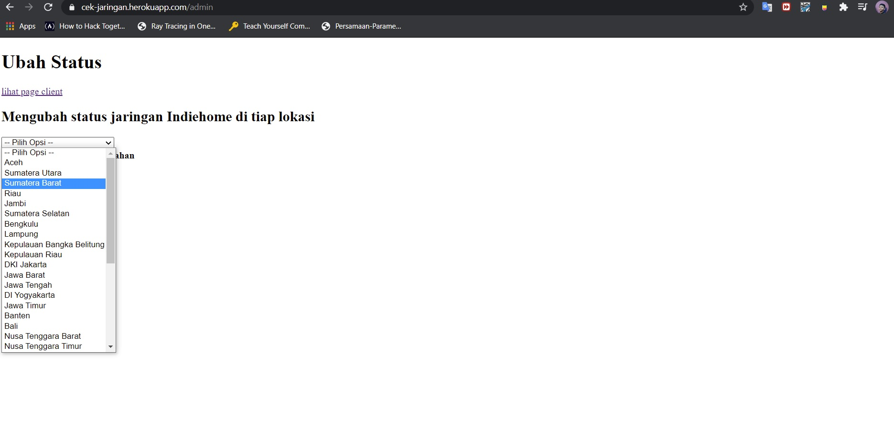
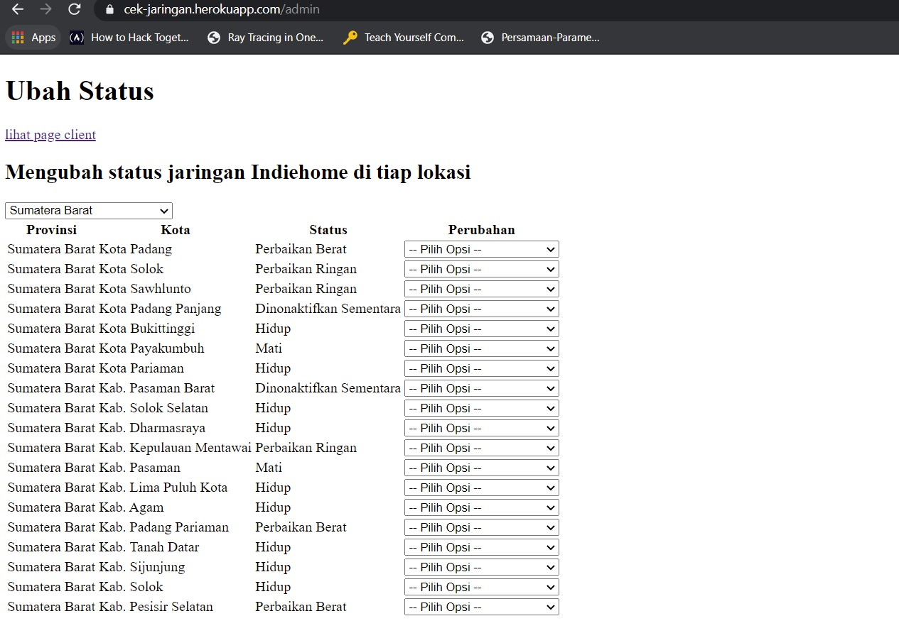

# Cek Jaringan Indohome
Tugas Akhir ARC 
## Deskripsi Singkat
Website ini bertujuan membantu pengguna Indohome dalam mengetahui kondisi jaringan Indohome di region mereka. 
Kondisi jaringan di tiap region dapat diubah oleh seorang administrator.
## Cara menggunakan
Akses website di link: https://cek-jaringan.herokuapp.com/
Harap bersabar bila loading lama karena layanan hosting gratis

Website terdiri dari dua buah arah. Website yang ditujukan untuk klien terdapat di '/' dan langsung terbuka ketika link diklik. Website yang ditujukan kepada administrator
terdapat di '/admin', terdapat link pula ke halaman administrator dari halaman client dan sebaliknya.

### Sebagai Klien
Ketika link dibuka, akan terlihat sebagai berikut:

Mendapatkan status dari lokasi dapat dilakukan dengan memilih lokasi pada dropdown lalu mengeklik tombol Cek Status:

Pilih Provinsi:

Pilih kota:

Selanjutnya klik tombol cek status dan tunggu hasil. Bisa jadi agak lama karena menggunakan layanan gratis MongoDB. Sehingga akan keluar
hasil seperti berikut sesuai dengan status dari region tersebut:

### Sebagai Admin
Ketika link menuju admin dibuka (/admin), akan terlihat sebagai berikut:

Dari sini, pilih provinsi dimana terdapat region yang ingin diubah statusnya:

Selanjutnya, akan muncul list kota dari provinsi tersebut serta status tiap kota tersebut:

Pada kota yang ingin diubah statusnya, pilihkan opsi perubahan pada dropdown:

Setelah diubah, maka kota yang diubah akan berubah statusnya pada halaman serta pada database. Halaman akan menjadi sebagai berikut: 

